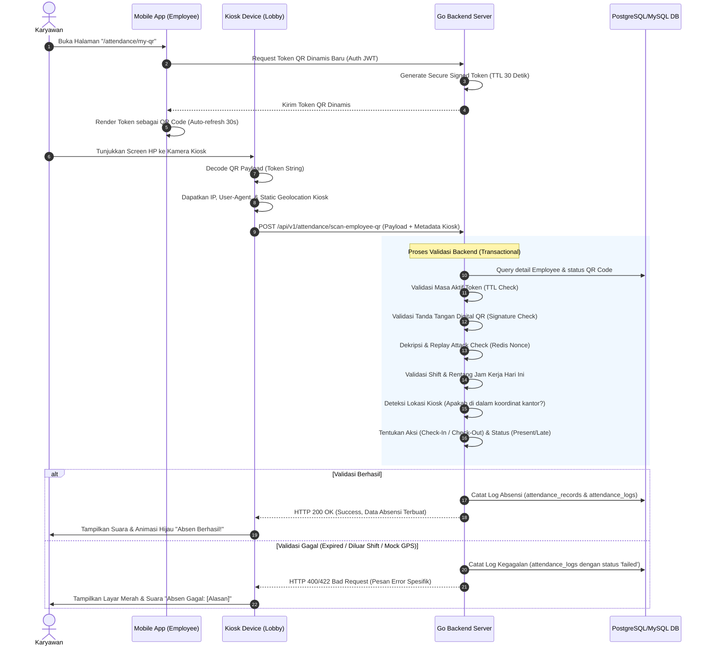
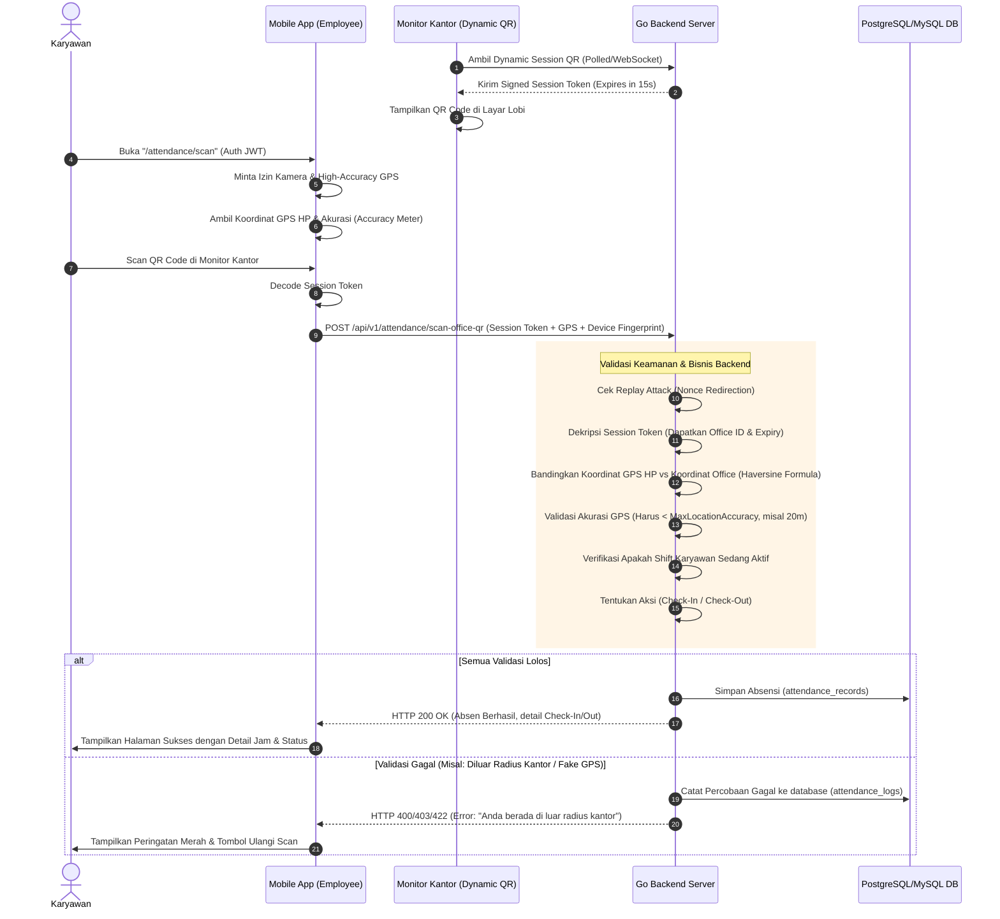
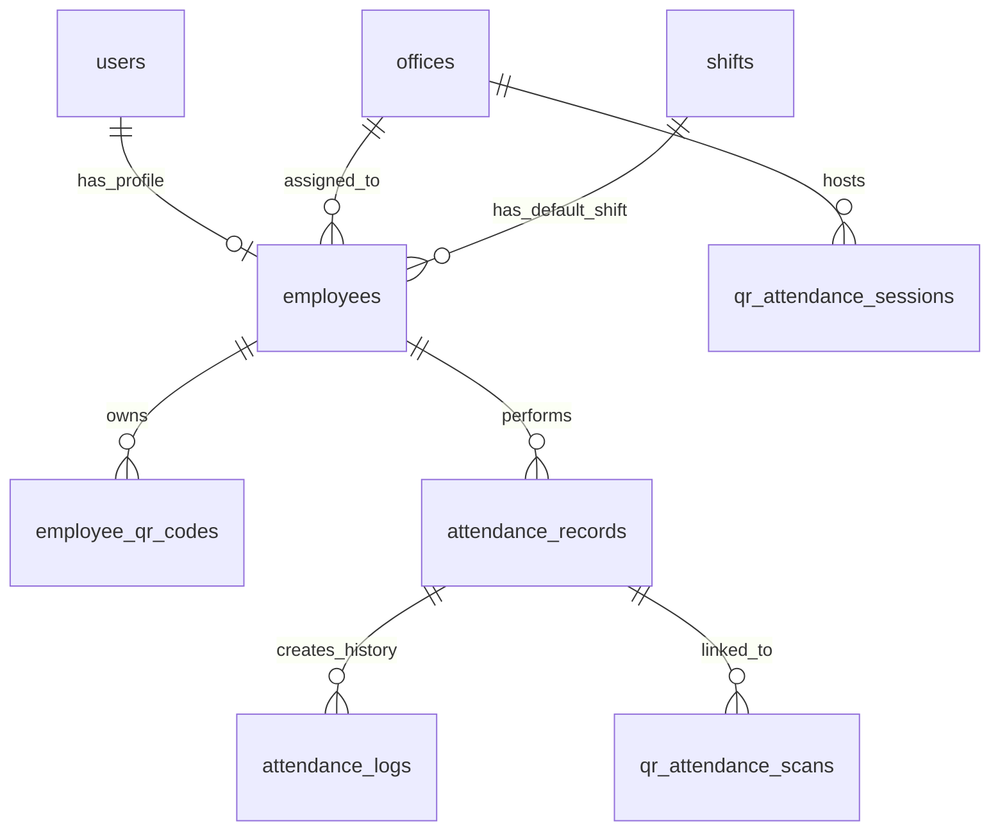

# Blueprint & Flow Analisis: Sistem Scan Barcode/QR Code Absensi

Dokumen ini menyajikan blueprint arsitektur lengkap, analisis flow, skema basis data, desain API, aturan keamanan, serta struktur frontend/backend untuk sistem absensi berbasis QR Code/Barcode yang *production-grade*.

Desain ini dikembangkan selaras dengan sistem absensi geofencing dan shift yang sudah berjalan pada codebase backend Go ([service.go](file:///e:/Proyek/Absensi/backend-absensi/internal/modules/attendance/service.go)) dan struktur model data GORM ([models.go](file:///e:/Proyek/Absensi/backend-absensi/internal/models/models.go)).

---

## 1. Ringkasan Flow & Paradigma Sistem

Untuk menghasilkan sistem absensi yang fleksibel dan aman dari manipulasi (*anti-fraud*), blueprint ini mendukung **dua paradigma utama** dalam penggunaan QR Code:

| Paradigma | Mekanisme Utama | Target Penggunaan | Keamanan |
| :--- | :--- | :--- | :--- |
| **Flow A: Employee Identity QR**<br>(Employee menampilkan QR, Kiosk men-scan) | Employee membuka aplikasi mobile, men-scan QR Code dinamis miliknya ke perangkat Kiosk/Tablet statis yang dipasang di lobi kantor. | Kantor dengan perangkat Kiosk terpusat (mengurangi ketergantungan GPS HP karyawan). | Sangat Tinggi. QR Code di-rotate setiap 30 detik di HP karyawan untuk mencegah manipulasi screenshot. |
| **Flow B: Dynamic Office QR**<br>(Office menampilkan QR, Employee men-scan) | Layar monitor di kantor menampilkan QR Code dinamis yang berubah setiap 10-30 detik. Employee menggunakan HP masing-masing untuk men-scan QR tersebut. | Kantor tanpa perangkat scanner khusus, memanfaatkan smartphone karyawan. | Tinggi. Membutuhkan verifikasi GPS HP karyawan secara presisi terhadap koordinat kantor. |

---

## 2. Diagram & Alur Bisnis (Business Flow)

### 2.1. Diagram Flow Tekstual (UML Sequence)

#### **Flow A: Employee Identity QR (Lobby Kiosk Scanner)**


#### **Flow B: Dynamic Office QR (Employee Smartphone Scanner)**


---

### 2.2. Penanganan Kasus Khusus Bisnis (Business Rule Validation)

1. **Flow Check-in / Check-out**: Sistem secara dinamis menentukan aksi absensi. Jika employee belum memiliki record absensi pada hari kerja bersangkutan, sistem mengarahkan ke **Check-In**. Jika sudah check-in dan belum check-out, sistem mengarahkan ke **Check-Out**.
2. **Scan QR Code Invalid/Malformed**: Menampilkan error dialog instan di frontend ("QR Code Tidak Dikenali"). Backend melempar error code `INVALID_QR_SIGNATURE` dan mencatat IP serta Device ID yang melakukan scanning untuk analisis ancaman.
3. **Employee Sudah Check-In/Check-Out Lengkap Hari Ini**: Jika terdeteksi scan tambahan setelah check-out selesai, sistem menolak transaksi dengan pesan "Anda sudah menyelesaikan absensi hari ini." (Mencegah manipulasi ganda).
4. **Scan di Luar Radius Kantor (Geofence Breach)**:
   - Berlaku untuk **Flow B**. Jarak dihitung menggunakan rumus *Haversine* di sisi backend menggunakan koordinat asli dari satelit GPS HP.
   - Jika jarak > `AllowedRadiusMeter` (misal 100 meter), backend menolak absensi.
   - Frontend menampilkan peta interaktif yang menunjukkan posisi karyawan saat ini terhadap perimeter lingkaran kantor.
5. **Scan di Luar Jam Shift**:
   - Sistem memvalidasi kolom `CheckInStart` dan `CheckInEnd` dari shift karyawan.
   - Jika di luar jam tersebut (misal check-in jam 14:00 padahal shift malam baru mulai jam 22:00), scan ditolak dengan instruksi: "Shift Anda belum dimulai. Silakan check-in mulai pukul 21:30."
6. **Akses Kamera/Lokasi Ditolak**:
   - Jika permission kamera diblokir, tampilkan UI alternatif berisi petunjuk visual interaktif cara mengaktifkan kamera di browser/OS.
   - Jika GPS diblokir (pada Flow B), proses scanning dinonaktifkan sepenuhnya dengan instruksi langkah-langkah aktivasi lokasi berakurasi tinggi.
7. **Koneksi Internet Terputus saat Scan**:
   - Jika internet putus sesaat sebelum payload dikirim, frontend menyimpan antrean scan secara lokal (*Offline Queue*).
   - Payload offline dienkripsi dengan *Public Key* backend di dalam storage lokal (IndexedDB) dan akan di-sync secara otomatis saat koneksi kembali stabil (menggunakan Service Worker / Navigator Online sync).

---

## 3. Desain Database (Database Schema Recommendation)

Skema basis data dirancang untuk PostgreSQL/MySQL untuk mengakomodasi pencatatan log verifikasi, status token, rotasi token, dan riwayat scan. 



### 3.1. Deskripsi Detail Kolom Database Baru

Berikut tabel-tabel baru dan modifikasi struktural untuk mendukung integrasi QR Code:

#### 1. Tabel `employee_qr_codes`
Tabel ini menyimpan token identitas QR Code dinamis milik employee yang digunakan pada **Flow A**.

```sql
CREATE TABLE employee_qr_codes (
    id UUID PRIMARY KEY DEFAULT gen_random_uuid(),
    employee_id UUID NOT NULL REFERENCES employees(id) ON DELETE CASCADE,
    token_hash VARCHAR(255) NOT NULL UNIQUE, -- SHA-256 hash dari raw token string
    status VARCHAR(20) NOT NULL DEFAULT 'active', -- 'active', 'revoked'
    created_at TIMESTAMP WITH TIME ZONE NOT NULL DEFAULT NOW(),
    created_by UUID NOT NULL REFERENCES users(id),
    revoked_at TIMESTAMP WITH TIME ZONE,
    revoked_by UUID REFERENCES users(id),
    last_used_at TIMESTAMP WITH TIME ZONE,
    updated_at TIMESTAMP WITH TIME ZONE NOT NULL DEFAULT NOW()
);

-- Indexing untuk pencarian cepat hash token saat scanning
CREATE INDEX idx_employee_qr_token_hash ON employee_qr_codes(token_hash);
CREATE INDEX idx_employee_qr_emp_active ON employee_qr_codes(employee_id) WHERE status = 'active';
```

#### 2. Tabel `qr_attendance_sessions`
Tabel ini digunakan untuk **Flow B** (Dynamic Office QR) guna mencatat sesi QR Code yang sedang aktif di monitor kantor.

```sql
CREATE TABLE qr_attendance_sessions (
    id UUID PRIMARY KEY DEFAULT gen_random_uuid(),
    office_id UUID NOT NULL REFERENCES offices(id) ON DELETE CASCADE,
    shift_id UUID REFERENCES shifts(id) ON DELETE SET NULL,
    session_token_hash VARCHAR(255) NOT NULL UNIQUE, -- Hash dari token dynamic QR
    purpose VARCHAR(20) NOT NULL DEFAULT 'both', -- 'check_in', 'check_out', 'both'
    expires_at TIMESTAMP WITH TIME ZONE NOT NULL, -- Expiration time (biasanya NOW() + 15-30 detik)
    status VARCHAR(20) NOT NULL DEFAULT 'active', -- 'active', 'expired', 'revoked'
    created_at TIMESTAMP WITH TIME ZONE NOT NULL DEFAULT NOW(),
    created_by UUID NOT NULL REFERENCES users(id),
    revoked_at TIMESTAMP WITH TIME ZONE,
    revoked_by UUID REFERENCES users(id)
);

CREATE INDEX idx_qr_session_hash_expiry ON qr_attendance_sessions(session_token_hash, expires_at) WHERE status = 'active';
```

#### 3. Tabel `qr_attendance_scans`
Tabel audit log khusus untuk mencatat setiap transaksi *scanning* (baik yang sukses maupun gagal terverifikasi). Sangat berguna untuk forensik *fake GPS* dan *replay attack*.

```sql
CREATE TABLE qr_attendance_scans (
    id UUID PRIMARY KEY DEFAULT gen_random_uuid(),
    qr_session_id UUID REFERENCES qr_attendance_sessions(id) ON DELETE SET NULL,
    employee_qr_code_id UUID REFERENCES employee_qr_codes(id) ON DELETE SET NULL,
    employee_id UUID NOT NULL REFERENCES employees(id) ON DELETE CASCADE,
    scanned_by_user_id UUID REFERENCES users(id),
    office_id UUID REFERENCES offices(id),
    attendance_id UUID REFERENCES attendance_records(id), -- Null jika scan gagal
    scan_type VARCHAR(30) NOT NULL, -- 'office_dynamic_qr', 'employee_identity_qr'
    action VARCHAR(20) NOT NULL, -- 'check_in', 'check_out'
    latitude DECIMAL(10, 8),
    longitude DECIMAL(11, 8),
    accuracy DECIMAL(8, 2),
    device_id VARCHAR(255) NOT NULL,
    ip_address VARCHAR(45) NOT NULL,
    user_agent TEXT NOT NULL,
    status VARCHAR(20) NOT NULL, -- 'success', 'failed'
    failure_reason TEXT,
    created_at TIMESTAMP WITH TIME ZONE NOT NULL DEFAULT NOW()
);

CREATE INDEX idx_qr_scans_employee ON qr_attendance_scans(employee_id, created_at DESC);
CREATE INDEX idx_qr_scans_device_status ON qr_attendance_scans(device_id, status);
```

---

## 4. Aturan Keamanan & Pencegahan Fraud (Security Rules)

Bagian ini memaparkan konfigurasi keamanan tingkat lanjut agar absensi tidak mudah dimanipulasi dengan screenshot, share token, GPS palsu, atau pemutaran ulang request API (*replay attack*).

### 4.1. Pembuatan Payload QR Code dengan Cryptographic Signature

Raw token QR Code tidak boleh berisi teks biasa seperti `"emp_123"` karena sangat mudah ditiru dan dimanipulasi. Payload QR Code harus dienkripsi atau diberi tanda tangan digital (*Cryptographic Signature*).

> [!IMPORTANT]
> Format Payload QR yang direkomendasikan adalah **JSON Web Token (JWT) bertanda tangan HMAC-SHA256 (HS256)** atau **Asymmetric Signature (RS256/ES256)** dengan masa aktif (TTL) sangat pendek (15 - 30 detik).

#### **Struktur Payload JWT Token QR Code:**
```json
{
  "iss": "sistem-absensi-server",
  "sub": "emp_018f9a2b-cf3e-4d4a-9b48-77babe72ed6e", // Employee ID
  "type": "employee_identity_qr",                   // Tipe token
  "office_id": "off_018f9a2c-df1c-4e8b-87cf-66f81a7b8e1a", // Home Office ID
  "iat": 1779034545,                                 // Issued At (Epoch Time)
  "exp": 1779034575,                                 // Expires At (Epoch Time, 30s TTL)
  "jti": "5a4f6d8c-2831-4b1a-963d-44a6701980d2"      // Unique Nonce UUID (Mencegah Replay)
}
```

*   **Pencegahan Screenshot / Foto QR**: Dengan batas waktu `exp` hanya 30 detik, screenshot QR Code yang dibagikan via chat tidak akan berlaku karena backend akan langsung menolaknya jika waktu scan melebihi 30 detik dari pembuatan.

### 4.2. Mekanisme Anti-Replay Attack dengan Redis

Meskipun token memiliki waktu kedaluwarsa 30 detik, penyerang masih bisa melakukan interupsi jaringan dan mengirimkan payload yang sama berkali-kali dalam rentang 30 detik tersebut.

**Solusi**:
1. Setiap kali backend sukses memproses absensi dari satu token QR, backend mengekstrak klaim `"jti"` (ID unik token).
2. Backend menyimpan `"jti"` tersebut ke dalam **Redis Cache** dengan TTL 30 detik menggunakan perintah:
   ```redis
   SETEX "qr_nonce:5a4f6d8c-2831-4b1a-963d-44a6701980d2" 30 "used"
   ```
3. Sebelum memproses absensi, sistem selalu memeriksa keberadaan `"jti"` di Redis. Jika `"jti"` sudah ada di Redis, sistem langsung melempar error `REPLAY_ATTACK_DETECTED` (HTTP 409 Conflict) dan memblokir sementara akun employee tersebut untuk investigasi.

### 4.3. Deteksi Fake GPS & Validasi Geolocation Tingkat Lanjut

Penyerang sering menggunakan aplikasi pihak ketiga seperti *Fake GPS / Mock Location* di Android/iOS untuk memanipulasi koordinat GPS yang dikirimkan oleh browser/frontend Next.js.

#### **Strategi Deteksi & Mitigasi Keamanan:**

```
+-------------------------------------------------------------------------------+
|                        ALUR DETEKSI KECURANGAN LOKASI                         |
+-------------------------------------------------------------------------------+
       |
       v
 1. Cek Akurasi GPS (Accuracy Meter)
       |---> Jika Akurasi > 50 meter  ==> REJECT (Sinyal Lemah / Modifikasi GPS)
       |---> Jika Akurasi == 0.00     ==> REJECT (Indikasi Emulator / Mocking API)
       v
 2. Bandingkan Koordinat GPS vs IP Geo-IP (Max-Distance Validation)
       |---> Jarak GPS vs IP > 50 KM  ==> REJECT & FLAG (Audit Log Alert: Spoofing)
       v
 3. Analisis Kecepatan Berpindah (Velocity Check)
       |---> Jarak Scan Terakhir vs Sekarang dibagi waktu > 300 km/jam ==> REJECT
       v
 4. Cek HTML5 Geolocation API Hardware Signal
       |---> Cek `location.coords.speed` dan `heading`
       v
[ LOKASI DINYATAKAN AMAN & VALID ]
```

1. **Enforce High Accuracy di Frontend**:
   ```typescript
   navigator.geolocation.getCurrentPosition(successCallback, errorCallback, {
     enableHighAccuracy: true, // Memaksa OS menggunakan hardware GPS satelit, bukan wifi/BTS cell tower
     timeout: 5000,
     maximumAge: 0
   });
   ```
2. **Validasi Geolocation Mutlak di Backend**:
   Jangan pernah memercayai frontend untuk menghitung jarak radius. Frontend hanya mengirimkan raw koordinat `(latitude, longitude, accuracy)`. Backend akan menghitung formula *Haversine* secara mandiri menggunakan data koordinat kantor yang disimpan aman di database server.
3. **Penyaringan Akurasi GPS**:
   Aplikasi *Fake GPS* sering mengembalikan akurasi yang "sempurna" secara artifisial (misal tepat 0.0 meter atau 1.0 meter secara statis) atau akurasi yang sangat buruk karena tidak mendapatkan sinyal satelit riil. Enforce batas toleransi akurasi yang logis (misalnya antara **3.0 meter sampai 25.0 meter**).
4. **Analisis Cross-Reference dengan IP Address (GeoIP)**:
   Backend melakukan verifikasi silang koordinat GPS dari browser dengan database GeoIP (seperti MaxMind GeoIP2). Jika koordinat GPS mengklaim berada di Jakarta, namun IP address ISP terdeteksi di Singapura atau Surabaya, backend akan menandai scan tersebut sebagai anomali tinggi dan memicu verifikasi wajah (*Biometric Verification*) atau menolaknya.

---

## 5. API Design (API Contract & RBAC)

Semua endpoint dilindungi oleh sistem otentikasi JWT/Session dengan Role-Based Access Control (RBAC) yang terintegrasi.

### 5.1. POST `/api/v1/attendance/qr/employee/generate`
*   **Deskripsi**: Digunakan oleh Admin/HR untuk membuat token awal QR Code bagi employee baru.
*   **Permission (RBAC)**: `super_admin`, `admin`, `hr`
*   **Headers**: `Authorization: Bearer <JWT_TOKEN>`
*   **Request Body**:
    ```json
    {
      "employee_id": "018f9a2b-cf3e-4d4a-9b48-77babe72ed6e"
    }
    ```
*   **Response Success (200 OK)**:
    ```json
    {
      "success": true,
      "message": "Employee QR Code token generated successfully",
      "data": {
        "employee_id": "018f9a2b-cf3e-4d4a-9b48-77babe72ed6e",
        "qr_token": "qr_ident_eyJhbGciOiJIUzI1NiIsInR5cCI6IkpXVCJ9.eyJzdWIiOiJlbXBfMDE4ZjlhMmItY2YzZS00ZDRhLTliNDgtNzdiYWJlNzJlZDZlIiwiaWF0IjoxNzc5MDM0NTQ1LCJleHAiOjI3Nzg3NjE2MDB9.sig",
        "status": "active",
        "created_at": "2026-05-17T23:15:45Z"
      }
    }
    ```

### 5.2. POST `/api/v1/attendance/qr/employee/regenerate`
*   **Deskripsi**: Digunakan untuk merotasi atau membatalkan QR Code lama employee (misal karena HP hilang atau indikasi fraud) dan membuat QR Code baru.
*   **Permission (RBAC)**: `super_admin`, `admin`, `hr`
*   **Request Body**:
    ```json
    {
      "employee_id": "018f9a2b-cf3e-4d4a-9b48-77babe72ed6e",
      "reason": "Indikasi screenshot dibagikan di grup chat"
    }
    ```
*   **Response Success (200 OK)**:
    ```json
    {
      "success": true,
      "message": "QR Code successfully revoked and regenerated",
      "data": {
        "employee_id": "018f9a2b-cf3e-4d4a-9b48-77babe72ed6e",
        "new_qr_token": "qr_ident_eyJhbGciOiJIUzI1NiIsInR5cCI6IkpXVCJ9.eyJzdWIiOiJlbXBfMDE4ZjlhMm...sig",
        "revoked_old_token_at": "2026-05-17T23:16:00Z"
      }
    }
    ```

### 5.3. POST `/api/v1/attendance/scan-office-qr` (Flow B)
*   **Deskripsi**: Dipanggil oleh Mobile App Employee untuk melakukan absensi dengan men-scan dynamic QR Code kantor.
*   **Permission (RBAC)**: `employee`
*   **Request Body**:
    ```json
    {
      "session_token": "qr_session_eyJhbGciOiJIUzI1NiIsInR5cCI6IkpXVCJ9.eyJvZmZpY2VfaWQiOiJvZmZf...",
      "latitude": -6.2088,
      "longitude": 106.8456,
      "accuracy": 12.5,
      "device_id": "iphone_15_pro_max_uuid_xyz",
      "notes": "Hadir tepat waktu"
    }
    ```
*   **Response Success (201 Created)**:
    ```json
    {
      "success": true,
      "message": "Attendance recorded successfully via Office QR Scan",
      "data": {
        "attendance_id": "018f9a2d-ec82-4fdf-8821-ff6a39b2cf03",
        "employee_id": "018f9a2b-cf3e-4d4a-9b48-77babe72ed6e",
        "attendance_date": "2026-05-17",
        "action": "check_in",
        "scanned_at": "2026-05-17T23:15:45Z",
        "status": "present", -- 'present' atau 'late'
        "late_minutes": 0,
        "distance_meters": 4.2
      }
    }
    ```
*   **Response Error (422 Unprocessable Entity - Diluar Radius)**:
    ```json
    {
      "success": false,
      "error_code": "OUTSIDE_ALLOWED_RADIUS",
      "message": "Absensi ditolak. Anda berada di luar radius kantor yang diperbolehkan (245 meter dari lokasi kantor).",
      "meta": {
        "calculated_distance": 245.3,
        "allowed_radius": 100.0
      }
    }
    ```

### 5.4. POST `/api/v1/attendance/scan-employee-qr` (Flow A)
*   **Deskripsi**: Dipanggil oleh perangkat Kiosk Lobi Kantor setelah men-scan QR Code dinamis milik employee.
*   **Permission (RBAC)**: `security`, `admin`, `super_admin` (Kiosk masuk menggunakan akun ber-role Kiosk/Security)
*   **Request Body**:
    ```json
    {
      "employee_qr_token": "qr_ident_eyJhbGciOiJIUzI1NiIsInR5cCI6IkpXVCJ9.eyJzdWIi...",
      "kiosk_office_id": "off_018f9a2c-df1c-4e8b-87cf-66f81a7b8e1a",
      "device_id": "lobby_tablet_01",
      "latitude": -6.2088,
      "longitude": 106.8456
    }
    ```
*   **Response Success (201 Created)**:
    ```json
    {
      "success": true,
      "message": "Employee absensi check-out successfully recorded via Kiosk Scan",
      "data": {
        "attendance_id": "018f9a2d-ec82-4fdf-8821-ff6a39b2cf03",
        "employee_name": "Rivael Manurung",
        "action": "check_out",
        "scanned_at": "2026-05-17T23:15:45Z",
        "status": "checked_out"
      }
    }
    ```

---

## 6. Frontend Structure & Next.js Components

Implementasi frontend menggunakan Next.js (App Router) dengan Tailwind CSS dan shadcn/ui. 

### 6.1. Folder Structure `/src`

```
src/
├── app/
│   ├── (employee)/
│   │   ├── attendance/
│   │   │   ├── page.tsx            # Beranda Absensi Employee (Status Hari Ini)
│   │   │   ├── scan/
│   │   │   │   └── page.tsx       # Scan Halaman Dynamic Office QR (Flow B)
│   │   │   ├── my-qr/
│   │   │   │   └── page.tsx       # Tampilkan Secure Dynamic QR Employee (Flow A)
│   │   │   └── history/
│   │   │       └── page.tsx       # Riwayat Absensi Pribadi Karyawan
│   ├── (admin)/
│   │   ├── admin/
│   │   │   ├── attendances/
│   │   │   │   ├── page.tsx       # Dashboard Absensi / Rekap Report (Admin/HR)
│   │   │   │   └── [id]/
│   │   │   │       └── page.tsx   # Detail Rekap Absensi Per Employee
│   │   │   └── kiosk/
│   │   │       └── page.tsx       # Perangkat Lobby Kiosk Scanner (Flow A)
├── components/
│   ├── attendance/
│   │   ├── qr-scanner.tsx          # Komponen Scanner menggunakan html5-qrcode (SSR disabled)
│   │   ├── qr-generator.tsx        # Komponen QR Code Employee dengan hitung mundur TTL
│   │   ├── status-card.tsx         # Card status kehadiran hari ini (Hadir, Telat, Absent)
│   │   ├── permission-alert.tsx    # Dialog peringatan izin kamera/GPS diblokir
│   │   ├── result-dialog.tsx       # Animasi dialog hasil scan (Berhasil/Gagal)
│   │   └── history-table.tsx       # Tabel list riwayat absensi employee
```

### 6.2. Implementasi Komponen Utama `/components/attendance/qr-scanner.tsx`

Untuk menghindari error hidrasi (*hydration error*) yang sering terjadi saat menginisialisasi pustaka pembaca kamera (seperti `html5-qrcode`) di sisi server Next.js, komponen ini dimuat dengan konfigurasi `ssr: false` di Next.js:

```typescript
// /components/attendance/qr-scanner.tsx
"use client";

import { useEffect, useRef, useState } from "react";
import { Html5QrcodeScanner } from "html5-qrcode";
import { AlertCircle, Camera } from "lucide-react";
import { Alert, AlertDescription, AlertTitle } from "@/components/ui/alert";

interface QRScannerProps {
  onScanSuccess: (decodedText: string) => void;
  onScanError?: (errorMessage: string) => void;
  isActive: boolean;
}

export default function QRScanner({ onScanSuccess, onScanError, isActive }: QRScannerProps) {
  const scannerRef = useRef<Html5QrcodeScanner | null>(null);
  const [permissionError, setPermissionError] = useState<boolean>(false);
  const scannerId = "attendance-qr-scanner-view";

  useEffect(() => {
    if (!isActive) {
      if (scannerRef.current) {
        scannerRef.current.clear().catch((err) => console.error("Error clearing scanner", err));
        scannerRef.current = null;
      }
      return;
    }

    // Inisialisasi scanner
    const scanner = new Html5QrcodeScanner(
      scannerId,
      { 
        fps: 15, 
        qrbox: { width: 260, height: 260 },
        aspectRatio: 1.0,
        showTorchButtonIfSupported: true
      },
      /* verbose= */ false
    );

    scanner.render(
      (decodedText) => {
        // Hentikan scan sementara setelah berhasil mendapatkan token
        scanner.clear().catch(err => console.error(err));
        onScanSuccess(decodedText);
      },
      (error) => {
        if (onScanError) {
          onScanError(error);
        }
      }
    );

    scannerRef.current = scanner;

    return () => {
      if (scannerRef.current) {
        scannerRef.current.clear().catch((err) => console.error("Unmount scanner cleanup error", err));
      }
    };
  }, [isActive, onScanSuccess, onScanError]);

  return (
    <div className="w-full max-w-md mx-auto overflow-hidden rounded-2xl border border-border bg-card shadow-lg p-4">
      <div className="relative aspect-square w-full overflow-hidden rounded-xl bg-muted flex items-center justify-center">
        {permissionError ? (
          <Alert variant="destructive" className="m-4">
            <AlertCircle className="h-4 w-4" />
            <AlertTitle>Kamera Tidak Diakses</AlertTitle>
            <AlertDescription>
              Silakan izinkan akses kamera pada pengaturan browser Anda untuk melanjutkan absensi QR.
            </AlertDescription>
          </Alert>
        ) : (
          <div id={scannerId} className="w-full h-full" />
        )}
      </div>
      <div className="mt-4 flex items-center justify-center gap-2 text-xs text-muted-foreground">
        <Camera className="h-4 w-4 animate-pulse text-primary" />
        <span>Posisikan QR Code berada di dalam kotak pemindai</span>
      </div>
    </div>
  );
}
```

---

## 7. Backend Implementation Plan (Go Architecture)

### 7.1. File Organisasi Modul Absensi di Backend
```
backend-absensi/
├── internal/
│   ├── models/
│   │   └── models.go               # Menyimpan struct EmployeeQRCode, QRAttendanceSession, dsb.
│   ├── pkg/
│   │   ├── crypto/
│   │   │   └── qr.go               # Utility penandatanganan dan enkripsi JWT QR Code
│   │   └── geolocation/
│   │       └── haversine.go        # Penghitung jarak koordinat bumi
│   ├── modules/
│   │   ├── attendance/
│   │   │   ├── service.go          # Implementasi fungsi CheckIn, CheckOut, ScanQR
│   │   │   ├── repository.go       # SQL Query database (GORM)
│   │   │   └── handler.go          # REST API Route Controller
```

### 7.2. Algoritma Handler Validasi QR Absensi di Go (`service.go`)

Berikut adalah draf implementasi logic untuk memproses **Flow B (Dynamic Office QR)** dengan validasi geofence, masa aktif token, akurasi, dan shift kerja karyawan.

```go
package attendance

import (
	"backend-absensi/internal/models"
	"backend-absensi/internal/pkg/crypto"
	"backend-absensi/internal/pkg/geolocation"
	"errors"
	"fmt"
	"time"
	"gorm.io/gorm"
)

type ScanOfficeQRRequest struct {
	SessionToken string  `json:"session_token" binding:"required"`
	Latitude     float64 `json:"latitude" binding:"required"`
	Longitude    float64 `json:"longitude" binding:"required"`
	Accuracy     float64 `json:"accuracy" binding:"required"`
	DeviceID     string  `json:"device_id" binding:"required"`
	Notes        string  `json:"notes"`
}

func (s *service) ScanOfficeQR(userID string, req ScanOfficeQRRequest, ip, ua string) (*models.Attendance, error) {
	// 1. Verifikasi Format Lokasi Dasar
	if err := validateLocation(req.Latitude, req.Longitude, req.Accuracy); err != nil {
		return nil, err
	}

	// 2. Dekripsi & Verifikasi Tanda Tangan Dynamic QR Token
	claims, err := crypto.VerifySessionQRToken(req.SessionToken, s.cfg.JWTSecret)
	if err != nil {
		return nil, fmt.Errorf("invalid or expired QR code: %w", err)
	}

	// 3. Cek Masa Aktif Sesi QR Token
	if time.Now().Unix() > claims.ExpiresAt {
		return nil, errors.New("QR code has expired, please scan the updated code")
	}

	// 4. Deteksi Replay Attack Menggunakan Redis
	nonceKey := fmt.Sprintf("qr_nonce:%s", claims.Nonce)
	isUsed, err := s.redis.Exists(nonceKey)
	if err == nil && isUsed {
		// Log potensi kecurangan
		s.logMaliciousActivity(userID, "replay_attack_attempt", req.DeviceID, ip, ua)
		return nil, errors.New("duplicate request detected: this QR code has already been scanned")
	}
	// Tandai token telah digunakan di Redis selama 30 detik
	_ = s.redis.SetEX(nonceKey, 30, "used")

	// 5. Query Employee Profile & Shift Status
	emp, err := s.repo.FindEmployeeByUserID(userID)
	if err != nil {
		return nil, errors.New("employee profile not found")
	}
	if !emp.IsActive {
		return nil, errors.New("employee account is inactive")
	}

	// 6. Validasi Office Match
	officeUUID := claims.OfficeID
	if emp.OfficeID != officeUUID {
		return nil, errors.New("this QR code belongs to a different office branch")
	}

	// 7. Hitung Geofencing Presisi dengan Koordinat Real-time GPS vs Target Office
	dist := geolocation.DistanceMeters(req.Latitude, req.Longitude, *emp.Office.Latitude, *emp.Office.Longitude)
	
	// Validasi tingkat akurasi GPS (mencegah Fake GPS dengan drift tinggi)
	if req.Accuracy > s.cfg.MaxLocationAccuracy {
		s.logScanAttempt(emp, "failed", "Accuracy too low", req, dist, ip, ua)
		return nil, fmt.Errorf("GPS signal accuracy too low (%.1fm), please move to an open area", req.Accuracy)
	}

	// Validasi Radius Geofence
	if emp.Office.GeofenceEnabled && dist > float64(emp.Office.AllowedRadiusMeter) {
		s.logScanAttempt(emp, "failed", "Outside office radius", req, dist, ip, ua)
		return nil, fmt.Errorf("absen ditolak: Anda berada %.1f meter di luar radius kantor", dist-float64(emp.Office.AllowedRadiusMeter))
	}

	// 8. Cek Waktu Shift & Validasi Windows Time
	now := time.Now()
	nowTime := now.Format("15:04")
	
	// Tentukan Aksi secara Dinamis: Check-In atau Check-Out
	existingAttendance, _ := s.repo.GetTodayAttendance(emp.ID.String())
	
	var attendanceRecord *models.Attendance
	
	if existingAttendance == nil {
		// --- PROSES CHECK-IN ---
		if !isTimeWithinWindow(nowTime, emp.Shift.CheckInStart, emp.Shift.CheckInEnd) {
			return nil, errors.New("outside check-in window for your shift")
		}

		status := models.StatusPresent
		lateMinutes := 0

		// Hitung Keterlambatan
		shiftStartStr := fmt.Sprintf("%s %s:00", now.Format("2006-01-02"), emp.Shift.StartTime)
		shiftStartTime, _ := time.ParseInLocation("2006-01-02 15:04:05", shiftStartStr, now.Location())
		tolerance := time.Duration(emp.Shift.LateToleranceMinutes) * time.Minute

		if now.After(shiftStartTime.Add(tolerance)) {
			status = models.StatusLate
			lateMinutes = int(now.Sub(shiftStartTime).Minutes())
		}

		attendanceRecord = &models.Attendance{
			EmployeeID:           emp.ID,
			OfficeID:             emp.OfficeID,
			ShiftID:              emp.ShiftID,
			AttendanceDate:       now,
			CheckInAt:            &now,
			CheckInLatitude:      &req.Latitude,
			CheckInLongitude:     &req.Longitude,
			CheckInAccuracy:      &req.Accuracy,
			CheckInDistanceMeter: &dist,
			Status:               status,
			LateMinutes:          lateMinutes,
			Notes:                req.Notes,
		}

		if err := s.repo.CreateAttendance(attendanceRecord); err != nil {
			return nil, err
		}

	} else {
		// --- PROSES CHECK-OUT ---
		if existingAttendance.CheckOutAt != nil {
			return nil, errors.New("you have already checked out for today")
		}

		if !isTimeWithinWindow(nowTime, emp.Shift.CheckOutStart, emp.Shift.CheckOutEnd) {
			return nil, errors.New("outside check-out window for your shift")
		}

		existingAttendance.CheckOutAt = &now
		existingAttendance.CheckOutLatitude = &req.Latitude
		existingAttendance.CheckOutLongitude = &req.Longitude
		existingAttendance.CheckOutAccuracy = &req.Accuracy
		existingAttendance.CheckOutDistanceMeter = &dist
		existingAttendance.Status = models.StatusCheckedOut

		if err := s.repo.UpdateAttendance(existingAttendance); err != nil {
			return nil, err
		}
		attendanceRecord = existingAttendance
	}

	// 9. Catat Transaksi Scan Sukses ke Log Audit
	s.logScanAttempt(emp, "success", "", req, dist, ip, ua)

	return attendanceRecord, nil
}
```

---

## 8. Penanganan Edge Cases Teknis (Advanced Edge Cases)

Untuk menjamin ketersediaan sistem absensi berlevel *enterprise*, berikut strategi penyelesaian kendala operasional ekstrim di lapangan:

### 8.1. Shift Malam Melewati Hari (Cross-Day/Overnight Shift)
*   **Kasus**: Employee masuk shift malam pukul 22:00 (Hari ke-1) dan pulang pukul 06:00 (Hari ke-2). Jika scan check-out dilakukan jam 06:00, database default menganggapnya absen check-in untuk Hari ke-2 (karena tanggal berubah).
*   **Solusi**:
    *   Setiap kali melakukan scan check-out, backend melakukan pencarian record kehadiran terdekat dalam rentang **14 jam ke belakang**.
    *   Jika ditemukan record check-in yang aktif pada hari sebelumnya (Hari ke-1) dan shift-nya adalah tipe *cross-day*, maka checkout tersebut dipasangkan sebagai checkout untuk record Hari ke-1, bukan membuat record baru di Hari ke-2.

### 8.2. Karyawan Lupa Melakukan Check-Out (Orphan Check-in)
*   **Kasus**: Karyawan check-in pagi hari, namun sore hari langsung pulang tanpa men-scan QR. Keesokan paginya, saat scan, sistem akan mendeteksi flow check-out (karena status records sebelumnya belum ditutup).
*   **Solusi**:
    *   **Auto-Close Job**: Jalankan cron scheduler setiap pukul 03:00 dini hari untuk memeriksa semua record absensi hari sebelumnya yang `check_in_at` berisi tetapi `check_out_at` kosong.
    *   Secara otomatis update kolom `check_out_at` dengan status default, beri tanda status `StatusAbsent` / `MissingCheckout`, dan kirimkan notifikasi alert via WhatsApp/Email bagi karyawan untuk mengajukan revisi kehadiran manual ke HR.

### 8.3. Jam Handphone Karyawan Tidak Sinkron / Diubah Manual
*   **Kasus**: Karyawan memundurkan jam sistem di pengaturan Android/iOS agar tidak dianggap terlambat saat men-scan QR Code.
*   **Solusi**:
    *   **Backend Server Time Enforcer**: Waktu absensi mutlak ditentukan oleh waktu NTP Server backend (`time.Now()`), bukan dari jam lokal frontend HP karyawan.
    *   Klaim token QR mengandung epoch timestamp pembuatan. Jika waktu pembuatan di token berselisih > 60 detik (bisa di depan atau di belakang) dengan jam server, backend langsung melempar error `CLOCK_DESYNCHRONIZED` dan membatalkan scan.

### 8.4. Terjadi Mutasi / Pindah Kantor Mendadak
*   **Kasus**: Employee yang terdaftar di Kantor Cabang A, mendadak ditugaskan ke Kantor Cabang B hari ini dan melakukan scanning absensi di Cabang B.
*   **Solusi**:
    *   Tabel `employees` memiliki relasi utama `office_id`, namun kita membuat relasi tambahan **multi-office assignment** di database (misal `employee_offices`) untuk menampung daftar cabang pendukung yang diizinkan.
    *   Jika barcode terdeteksi valid untuk Kantor B, namun bukan kantor utama karyawan, sistem memeriksa tabel penugasan sementara. Jika cocok, absensi dicatat di Kantor B dengan penanda khusus "Absensi Luar Kantor / Tugas Cabang".

---

## 9. Security Checklist & Production-Grade Improvement

Gunakan checklist ini untuk menguji kelayakan rilis sistem di lingkungan production:

### 🛡️ Security Audit Checklist
- [ ] **Cryptographic Signature**: Tidak ada payload QR Code yang berupa plain text. Semua token menggunakan signed JWT / enkripsi symmetric AES-256-GCM.
- [ ] **Dynamic Expiration**: Token dynamic QR memiliki masa kedaluwarsa maksimal 30 detik (tidak bisa di-screenshot/di-share).
- [ ] **Replay-Attack Protection**: JTI Nonce di-cache di Redis untuk memastikan satu token QR hanya bisa di-scan satu kali secara eksklusif.
- [ ] **Server-Side Verification**: GPS, Radius Geofence, Toleransi Keterlambatan, dan Status Kehadiran dihitung seutuhnya di sisi server backend.
- [ ] **GPS Mocking Prevention**: Saringan akurasi GPS membatasi nilai accuracy < 20 meter dan mendeteksi ketiadaan sensor satelit fisik.
- [ ] **Rate Limiting**: Endpoint scan dibatasi maksimal 5 hit per menit per IP/User untuk menahan brute-force payload QR.
- [ ] **Audit Trail Log**: Semua scan gagal disimpan di tabel `qr_attendance_scans` beserta User-Agent, Device ID, IP, dan alasan kegagalannya untuk pelaporan mitigasi keamanan.

### 🚀 Production-Grade Tech Stack Improvement
1. **Redis Enterprise Cluster**: Gunakan Redis untuk mempercepat validasi token *nonce* (Replay Attack) dan rate-limiting. Redis menjamin response time backend tetap sub-milidetik saat jam sibuk masuk kantor (misal pukul 07:45 - 08:00).
2. **WebSocket (Socket.io/Centrifugo) untuk Kiosk**:
   Pada **Flow B** (Dynamic Office QR), gunakan WebSocket untuk menyiarkan token dynamic QR baru dari backend ke monitor kantor setiap 15 detik. Ini jauh lebih ringan dan real-time dibanding teknik polling HTTP biasa.
3. **Penyimpanan Gambar Percobaan Gagal**:
   Ketika scan gagal dengan status mencurigakan (misal mock GPS berulang), pemicu kamera perangkat Kiosk untuk mengambil foto senyap wajah pelaku scan dan simpan di Cloud Storage (S3) untuk diserahkan ke bagian kepatuhan HR.
4. **Offline Local Signed Cryptography (Resilience Mode)**:
   Jika koneksi internet kantor lobi terputus total:
   * Kiosk dapat beralih ke mode offline.
   * Kiosk men-scan QR karyawan, memverifikasi tanda tangan kriptografi token secara lokal menggunakan *Public Key* yang disimpan di memori Kiosk, memvalidasi masa berlaku jam (jika jam hardware internal Kiosk tersinkron baterai RTC).
   * Record scan disimpan secara lokal dan aman di SQLite terenkripsi milik Kiosk, lalu di-sync massal ketika internet menyala kembali.

---

## 10. Struktur Output & Panduan Implementasi

Dokumen `feedback.md` ini telah selesai dibuat dan siap dijadikan acuan utama development. 

### Langkah Selanjutnya:
1. Jalankan migrasi database PostgreSQL dengan query DDL baru pada tabel `employee_qr_codes`, `qr_attendance_sessions`, dan `qr_attendance_scans`.
2. Pasang modul `VerifySessionQRToken` pada pustaka backend internal.
3. Gunakan integrasi dinamis Next.js `next/dynamic` dengan opsi `{ ssr: false }` saat memuat komponen `QRScanner` di frontend untuk menghindari kegagalan SSR.
